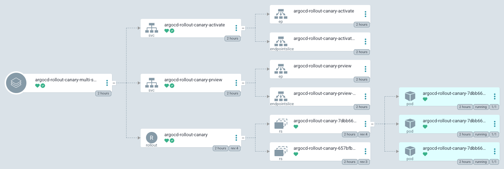
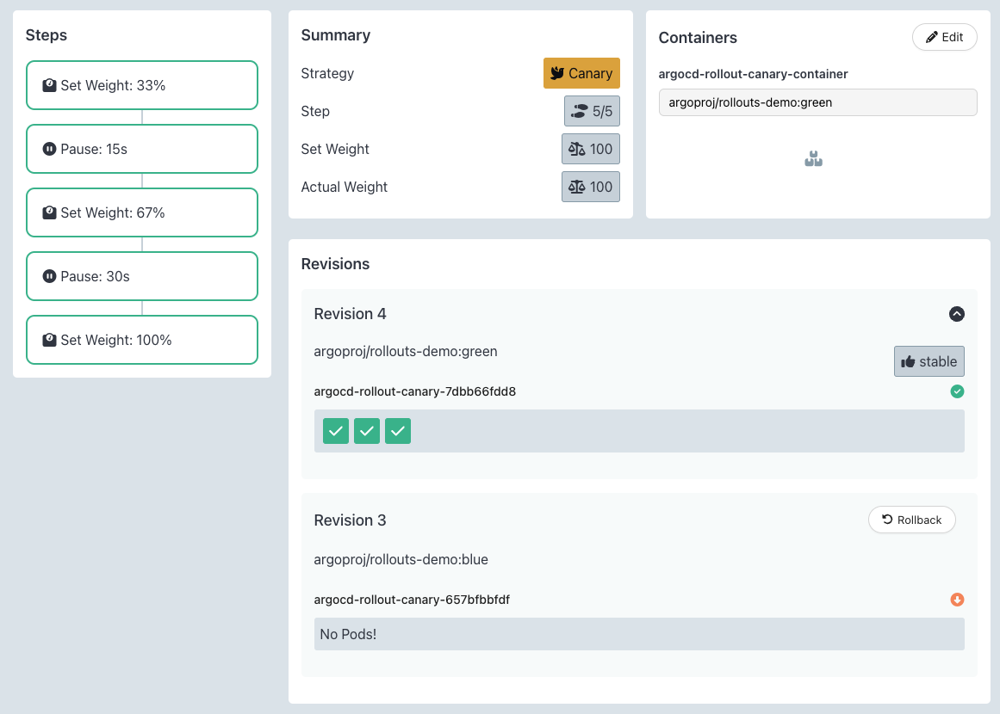

# argo-cd-blue-green-multi-service


<br>


## Scripts

```shell
# Check
root@MacBookPro ~/ % kubectl argo rollouts list rollout -n argo-cd
NAME                    STRATEGY   STATUS        STEP  SET-WEIGHT  READY  DESIRED  UP-TO-DATE  AVAILABLE
argocd-rollout-canary   BlueGreen  Paused        -     -           2/4    2        2           2           
```